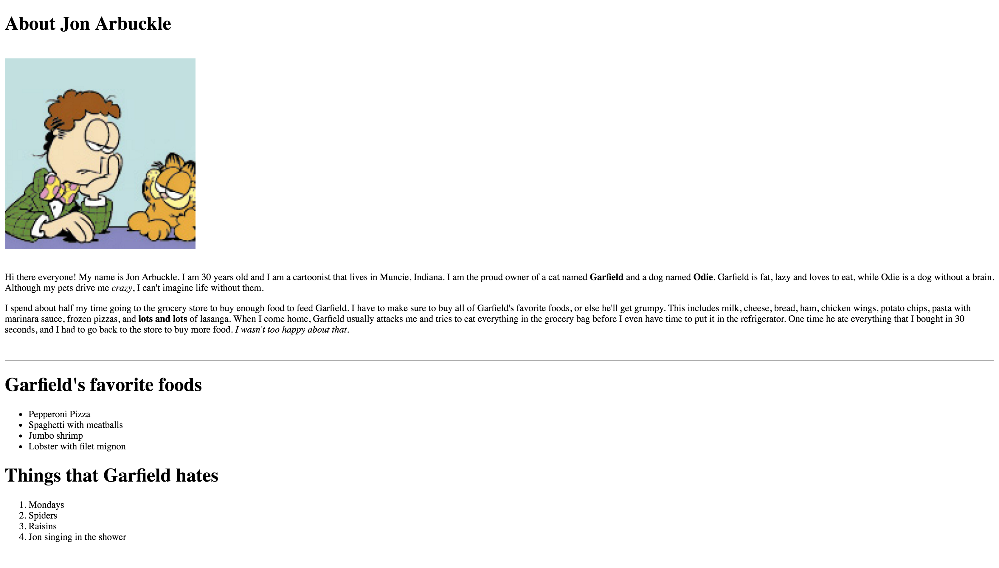

 
### AUSTIN COMMUNITY COLLEGE 
#### Web Software Bootcamp 2019
###### May 2019 - Nov 2019

# PROJECT 1

## Learning Goal

1. How to write basic HTML page.

About Jon Arbuckle This is the home page of Jon Arbuckle, a cartoon character who owns a cat named Garfield.

When building this site, keep in mind that you:

- Must use the br and hr tags
- Must use the h1, u, strong, em, and p tags
- Must create two lists: one ordered, and one unordered

The completed page would look like ...

