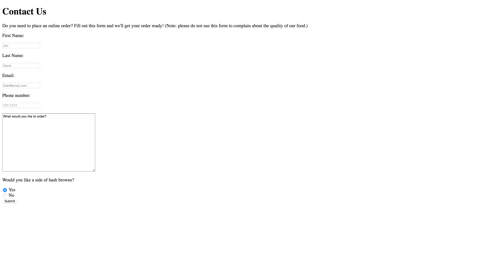

 
### AUSTIN COMMUNITY COLLEGE 
#### Web Software Bootcamp 2019
###### May 2019 - Nov 2019

## Project 3

### Learning Goal

  1. Forms

  **The Breakfast Restaurant**

A website for a restaurant that only serves breakfast.

You’ll need to have three separate HTML files. The images are located in a sub-folder called “img”.

The idea is to practice linking between separate files, as well as accessing files located in different folders (images in this case.)

The completed pages would look like ...

### Page 1 - The Breakfast Restaurant

### Page 2 - The Menu

### Page 3 - Contact Us

