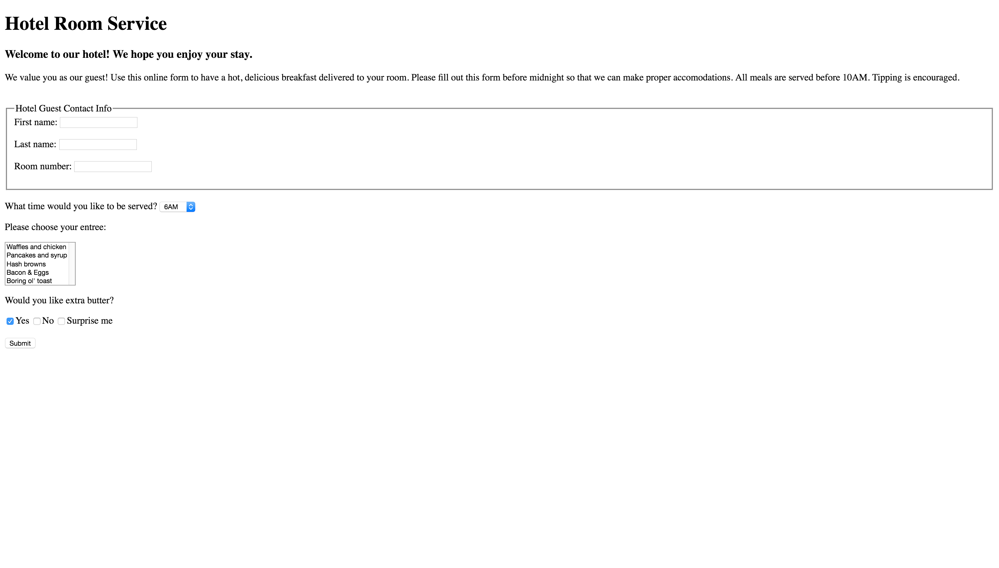

 
### AUSTIN COMMUNITY COLLEGE 
#### Web Software Bootcamp 2019
###### May 2019 - Nov 2019

# Project 4

## Learning Goal

1. Use of HTML Forms
  
  **Hotel Room Service** 

A simple form page for a hotel that allows the guest to order a hot, delicious breakfast in the morning.

The drop down box next to “What time would you like to be served?” should display 6AM, 7AM, 8AM, 9AM and 10AM.

The finished page should look like ...

